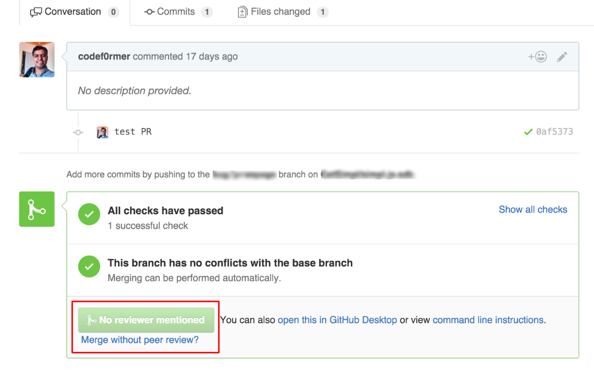
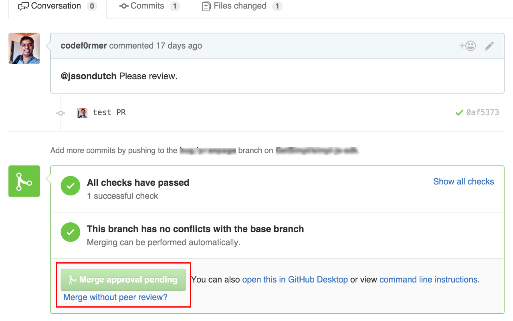

# PRampage

A chrome extension to avoid rampage by enforcing PR review with @Mentions on GitHub. Comment `LGTM` if Okay.

> I had a simple problem - How do I enforce code review among peers the easy way?
> 
> Most of us tag peers to get our PR reviewed from. So I consider the tagged peers as reviewers and make`Merge pull request` button disabled until all of the reviewers commented as `LGTM` i.e. Looks Good To Me.
> 
> If you want more granular control over who and how one does the code review, I would recommend using https://pullapprove.com instead. But again, this is the easy fix for the simple problem I had..!

